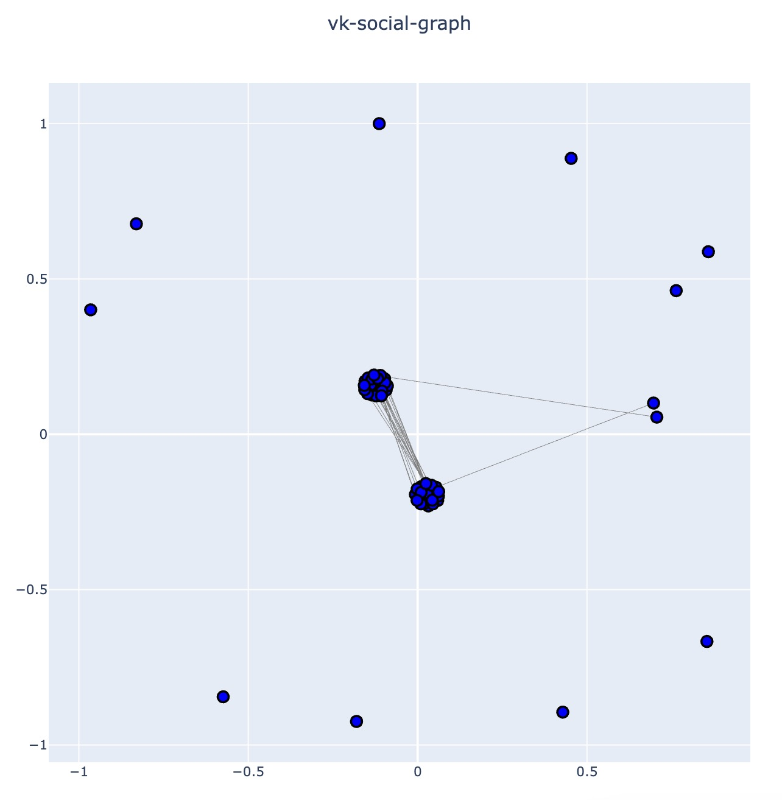

# VK Social Graph

Программа позволяет построить граф своих друзей в VK по признаку.

Доступные признаки:

- Год рождения (`byear`)
- Город (`city`)
- Пол (`sex`)
- Университеты (`universities`)

## Установка

Для работы необходим Python3.10+

После клонирования репозитория необходимо установить зависимости:

Windows
```bash
# перейдите в папку проекта

$ python -m venv venv
$ .\venv\Source\activate.bat
$ pip install -r requirements.txt
```

Linux, macOS
```bash
# перейдите в папку проекта

$ python3 -m venv venv
$ source venv/bin/activate
$ pip install -r requirements.txt
```

После этого создайте файл `.env` и напишите в нем:
```txt
ACCESS-TOKEN=[ваш_токен]
```

`ACCESS-TOKEN` можно получить на [данном сайте](https://vkhost.github.io/). Выберете пункт `Настройки`, в нем выберите права:

- Друзья
- Доступ в любое время

Нажмите `Получить` и из адресной строки возьмите токен.

## Пример работы

```bash
$ python main.py
Введите свой ID пользователя: [ваш_id]
Введите признак, по которому будет строится граф: [признак]
```
